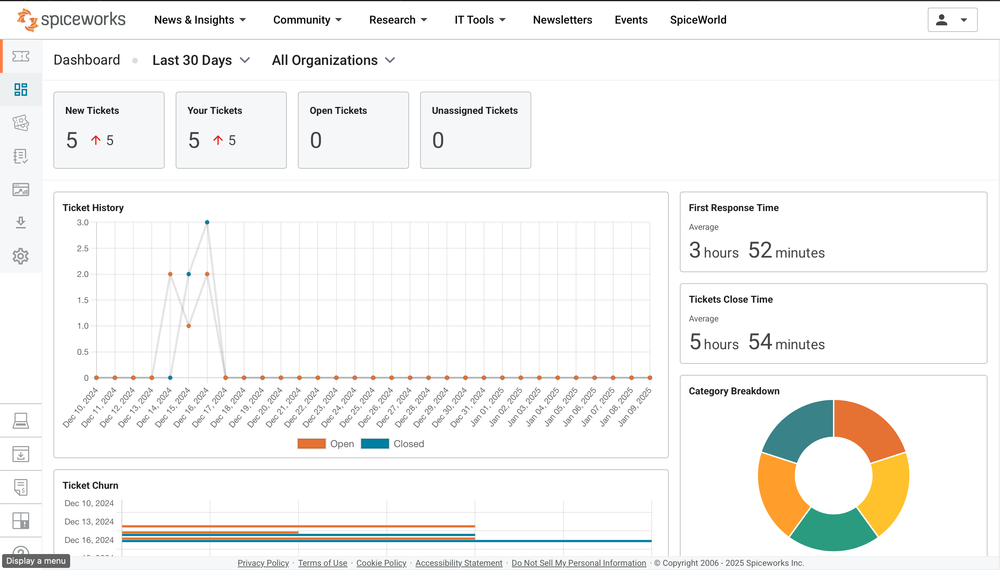

## Spiceworks Help Desk

| Image                                                                                     | Description                                                                                                                                                                                                                                         |
| ----------------------------------------------------------------------------------------- | --------------------------------------------------------------------------------------------------------------------------------------------------------------------------------------------------------------------------------------------------- |
|  | The dashboard of the Spiceworks help desk. From this page, you can see new tickets, open tickets, unassigned tickets, average ticket statistics, and category ticket statistics.                                                                      |
|      | These are some of the rules that automatically trigger actions to improve the workflow of the help desk. For example, tickets with keywords like "password" are routed to the Authentication category and automatically tagged as low priority.       |
|      | This shows the users who are part of the help desk and getting assigned tickets.                                                                                                                                                                     |
|  | A view of the tickets that have been closed in the system.                                                                                                                                                                                          |
|  | The database built so far, including knowledge base articles that help users and help desk employees streamline workflows and minimize downtime.                                                                                                     |
|  | An example of what a ticket might look like.                                                                                                                                                                                                        |
